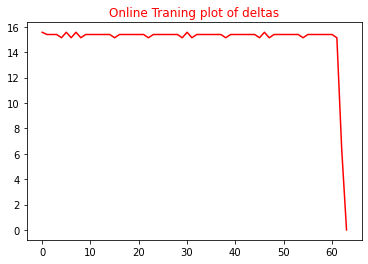
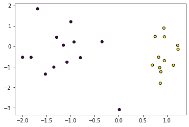

# Assignment 1 

### Names: 
#### Ahmed Mahmoud Fawzi 1170523 ###
#### Youssef Amr Ahmed   &nbsp; &nbsp; &nbsp; &nbsp;1170157 ####
---

&nbsp;
# Important Imports to Run the Code:
    from sklearn.datasets import make_classification
    import numpy as np
    import sys
    import random
    from numpy.linalg import norm
    import matplotlib.pyplot as plt
    from sklearn.metrics import accuracy_score
    from sklearn.model_selection import train_test_split

# Online Training Algorithm

        In this Algorithm we set the weights according to the number of features in the input then we intialize the Deltas with zeros then for the whole length of the input data in each step we multiply the label with the dot product of the weights and the features if the reuslt is less than or equal to the zero we then compute new delta which in this case it is equal to the current delta subtract the multiplication of the label with the current feature. Then we compute the new weight by subtracting it from the new delta divided by the total length of the input data.

        We continue to repeat this process every unitl the first norm of delta becomes so small this is where my trainig has approximately zero error value.

# Online Training Pseudo Code

# Batch Perceptron Algorithm

        This Algorithm is exactly like the Online training with only one difference in each epoch we update the weights regarding whether the condition that says that multipling the label with the dot product of the weights and the current features must be less than or equal to zero.

        This usualy results in huge number of weight changes compared to that of the Online Training

# Batch Perceptron Pseudo Code

# Code Implemented

We Designed a code that combines both Algortithms togethor instead of repeating them with a condition that checks if the user wants Online Training or Batch Perdeptron Algorithm as seen in the Jupyter Notebook code.

---

# Comparisons After Running the Codes on Question 1 and 4 Sheet 3

## Question 1 Comparison
---

 We intialized the Weights to be generated randomly between -1,1

 Then we run the code on Question 1 
 the Following Came 

    Input Weights: [-0.79747058 -0.71475836]

    Weights From Batch Algorithm: [ -3.92247058 417.28524164] 

    Weights From Online Algorithm: [-0.12364245 10.21981195] 

    Deltas From Batch Algorithm:  [0. 0.] 

    Deltas From Online Algorithm:  [0. 0.] 

    Number of Epochs to achieve zero error in Batch Algorithm:  2093 

    Number of Epochs to achieve zero error in Online Algorithm:  64 

    Number of times the weights changes in Batch Algorithm:  2093 

    Number of times the weights changes in Online Algorithm:  194 

This results between the 2 algorithms when we did Question 1 on them showed that and confirmed that the number of weight chnages in the Batch Algorithm is greater than that of the Online Training this shows that it takes a greater time to achieve the zero error as shown on the grapsh it took around 2093 times to reach that zero error compared to that of online training which took 64 epochs. The number of weight changes in the Online Algorithm is greater than the number of epochs as it updates multiple time in each epoch.

---

## Question 4 Comparison

    Input Weights:[-0.74440159 -0.78666462  0.69059787 -0.41727511]

    Weights From Batch Algorithm: [ 6.30055984e+01  6.29633354e+01 -9.49344021e+01  8.27248889e-02] 

    Weights From Online Algorithm: [ 63.57368313  31.64863811 -75.510574     0.12063154] 

    Deltas From Batch Algorithm:  [0. 0. 0. 0.] 

    Deltas From Online Algorithm:  [0. 0. 0. 0.] 

    Number of Epochs to achieve zero error in Batch Algorithm:  6 

    Number of Epochs to achieve zero error in Online Algorithm:  5 

    Number of times the weights changes in Batch Algorithm:  6 

    Number of times the weights changes in Online Algorithm:  12 

When we added the data with more features for Question 4 the results varied from those of Question 1 th number of epochs of the online  those of Batch Algorithm are so close to each other it took 6 epochs to reach zero error in Batch and 5 epochs to reach zero in Online. This time the number of weight changes in the Online was greater than that of the Batch Algorithm. 

---

# Generated Data

    Input Weights: [0.40292386 0.6794283 ]

    Weights From Batch Algorithm: [0.80543306 0.18095889] 

    Weights From Online Algorithm: [0.66338644 0.29183643] 

    Deltas From Batch Algorithm:  [0. 0.] 

    Deltas From Online Algorithm:  [0. 0.] 

    Number of Epochs to achieve zero error in Batch Algorithm:  2 

    Number of Epochs to achieve zero error in Online Algorithm:  3 

    Number of times the weights changes in Batch Algorithm:  2 

    Number of times the weights changes in Online Algorithm:  5

After Inputing the generated data in the Alogorithms the Output Weights this time was close to each other and that the Batch took 2 epochs to reach zero error while the Online took 3 to reach Zero Errors. This may be due to the huge number of training data 18 data.

---

# Accuracy Comparisons

### Batch Algorithm Model Prediciton Accuracy: 1.0
### Online Algorithm Model Prediciton Accuracy: 1.0

##### Surprisinngly ! the Model were able to predict the test set effieciently given the new Weights that achieve zero Error in the training data.

# Model Line Plot

# Functions Implemented

Function that add bias of ones to features array.

        def AddBias(X):
            totalLength=len(X) 
            dataLength=len(X[0])
            for i in range (totalLength): 
                X[i].append(1) #add bias to each entered data
            X = np.array(X)
            X = X.reshape(totalLength,dataLength+1) 
        return X
---
Function that generates random weights for array of size equal number of features + bias.

    def GenerateWeights(a,b,n):
        W=[]
        for i in range(0,n):
            r = np.random.uniform(a,b)
            W.append(r)
        W=np.asarray(W)
        print(W)
    return W
---
Function that classify data to their classes depending on the input trained data.

    def Predict_classification (data,W,bias=True):
        prediction=[]
        if(bias):
            data=AddBias(data) 
        else:
            data=np.array(data) 
        for j in data:
            prediction.append(np.sign(W.dot(j))) 
        prediction=np.asarray(prediction)
        return prediction
---
Function to Print Comparisons between the Online and Batch Algorithms. It takes the outputs from the training Algorithm and then prints the outputs.

    def Compare_Data(W1,Delta1,wchanges1,Epochs1,Dchange1,W2,Delta2,wchanges2,Epochs2,Dchange2):
        print("Weights From Batch Algorithm:",W1,"\n")
        print("Weights From Online Algorithm:",W2,"\n")
        print("Deltas From Batch Algorithm: ",Delta1,"\n")
        print("Deltas From Online Algorithm: ",Delta2,"\n")
        print("Number of Epochs to achieve zero error in Batch Algorithm: ",Epochs1,"\n")
        print("Number of Epochs to achieve zero error in Online Algorithm: ",Epochs2,"\n")
        print("Number of times the weights changes in Batch Algorithm: ",wchanges1,"\n")
        print("Number of times the weights changes in Online Algorithm: ",wchanges2,"\n")
---
This Function Calls Make Classification Function to generate x and y and Mask the Ydata.

    def MakeClassification_and_MaskY():
        newx, newy = make_classification(25, n_features=2, n_redundant = 0, n_informative = 1, n_clusters_per_class = 1) #generate random data and random results
        mask_for_y = newy == 0 
        newy[mask_for_y] = -1
        return newx,newy
---
A function implemented that is responsible to split and shuffle the data returning xtrain,xtest,ytrain,ytest.

    def ShuffleandSplit(newx,newy,trainsize):
        shuffledIdxs = np.arange(newx.shape[0])
        random.shuffle(shuffledIdxs)     # shuffle the indecies
        x = newx[shuffledIdxs,:]         #make the shuffled x
        y= newy[shuffledIdxs]           # shuffle the y also like the x values
        xtrain=x[:int(trainsize*len(x))]    # make the train equals to 0-traininputsize in percentage*totallength
        ytrain=y[:int(trainsize*len(y))]
        xtest=x[int(trainsize*len(x)):]   # make the test equals to from traininputsize in percentage*totallength-totallength
        ytest=y[int(trainsize*len(y)):]
        return xtrain,xtest,ytrain,ytest
---
Draw Model Line Function 

    def DrawModelLine(NW,Hx,Hy):
        m = -NW[0]/NW[1]   
        sorteddata=np.sort(Hx[:,0], axis=-1, kind=None, order=None) 
        yd=m*sorteddata 
        plt.plot(sorteddata , yd, 'k', lw=1) 
        plt.scatter(Hx[:, 0], Hx[:, 1], marker='o', c=Hy, s=25, edgecolor='k') 

---
# Algorithm Code Implemented 

    def Training_Algorithm(X,Y,Algorithm,Weights,LearningRate=1): 
        DataLength=len(X) #number of train data
        Epsilon=sys.float_info.epsilon #small number near zero
        wchanges=0 #a varibale that counts the number of weight changes happened  
        DeltaChanges=[]
        Epochscounter=0 #count the number epoch until norm of Delta become less than Epsilon
        while(Epochscounter == 0 or norm(Delta,1)>Epsilon): 
            i=0 
            Epochscounter+=1
            Delta = np.zeros(len(X[0])) with length equals that of the weights "number of features + bias"        
            while(i<DataLength): #loop over all entered data
                Prediction=Weights.dot(X[i]) 
                if(Y[i]*Prediction<=0): 
                    YX=Y[i]*X[i]
                    Delta=Delta-(YX) #update delta 
                    if(Algorithm=="Online Traning"):  
                        Delta=Delta/DataLength
                        Weights=Weights-(LearningRate*Delta) #update weights
                        wchanges+=1

                i+=1
            if(Algorithm=="Batch Perceptron"): #update weights after each epoch "if you want to make with Batch Perceptron"
                Delta=Delta/DataLength
                Weights=Weights-(LearningRate*Delta) #update weights
                wchanges+=1
            DeltaChanges.append(norm(Delta, 1))
        return Weights,Delta,wchanges,Epochscounter,DeltaChanges  
---
# Note Functions Are all fully documented in the Jupyter Notebook 